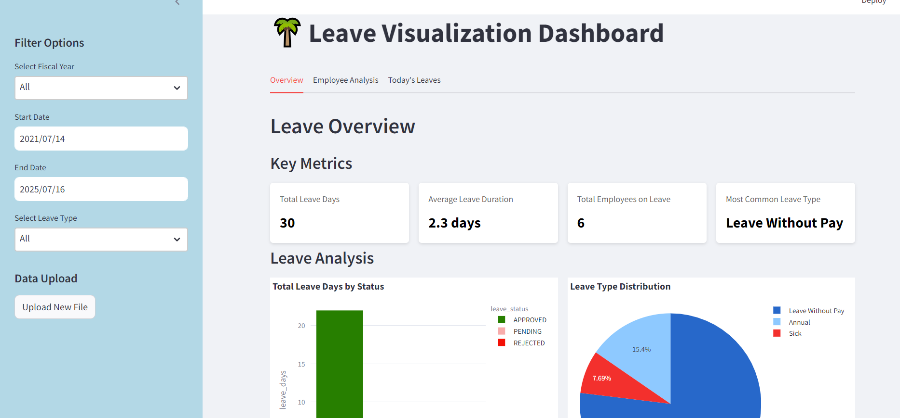

# Leave Visualization System

The Leave Visualization System is a full-stack solution designed for efficient management and visualization of employee leave data. It integrates multiple components to provide a streamlined user experience, from data ingestion and transformation to visualization and reporting.

## Project Structure

The project is composed of three main services:

1. `app`: The server acts as the backend, handling data requests from the Streamlit UI and connecting to the PostgreSQL database for data storage and retrieval.
2. `streamlit`: A Streamlit frontend for visualization
3. `postgres`: A PostgreSQL database

## Prerequisites

- Docker
- Docker Compose

## Setup and Installation

1. Clone this repository:
   ```
   git clone git@github.com:PrakritiPaudel/Leave-Visualization-System.git
   cd Leave-Visualization-System
   ```

2. Create a `.env` file in the root directory with necessary environment variables.

3. Build and start the containers:
   ```
   docker-compose up --build
   ```

## Services

### App Service

- Built from the Dockerfile in the root directory
- Exposed on port 5000
- Connected to both frontend and backend networks
- Depends on the PostgreSQL service

### Streamlit Service

- Built from `Dockerfile.streamlit`
- Exposed on port 8502 (mapped to 8501 internally)
- Connected to the frontend network
- Depends on the app service

### PostgreSQL Service

- Uses PostgreSQL 15
- Exposed on port 5432
- Environment variables:
  - POSTGRES_USER: prakriti
  - POSTGRES_PASSWORD: mypassword
  - POSTGRES_DB: mydatabase
- Connected to the backend network

## Networks

The application uses two separate docker networks for inter container communication:

- `backend`: For communication between the server(app) and database
- `frontend`: For communication between the server(app) and Streamlit service

## Running the Application

1. Build and start all services:
   ```
   docker-compose up --build
   ```

2. Access the main application at `http://localhost:5000`

3. Access the Streamlit frontend at `http://localhost:8502`

4. To stop the application:
   ```
   docker-compose down
   ```

## Troubleshooting

If you encounter any issues, check the Docker logs:

```
docker-compose logs -f
```

For specific service logs:

```
docker-compose logs -f [service_name]
```

Replace `[service_name]` with `app`, `streamlit`, or `postgres`.

## Using Airflow

Airflow is used for managing workflows, particularly for data ingestion and transformation tasks.

1. Start the Airflow scheduler:
   ```
   airflow scheduler
   ```

2. Start the Airflow webserver:
   ```
   airflow webserver --port 8082
   ```

3. Access the Airflow web interface at `http://localhost:8082/home`

4. To run ingestion and transformation tasks, navigate to the DAGs section in the Airflow web interface and trigger the transform_data_funtion DAG.

## System Architecture


## Leave Visualization Dashboard


